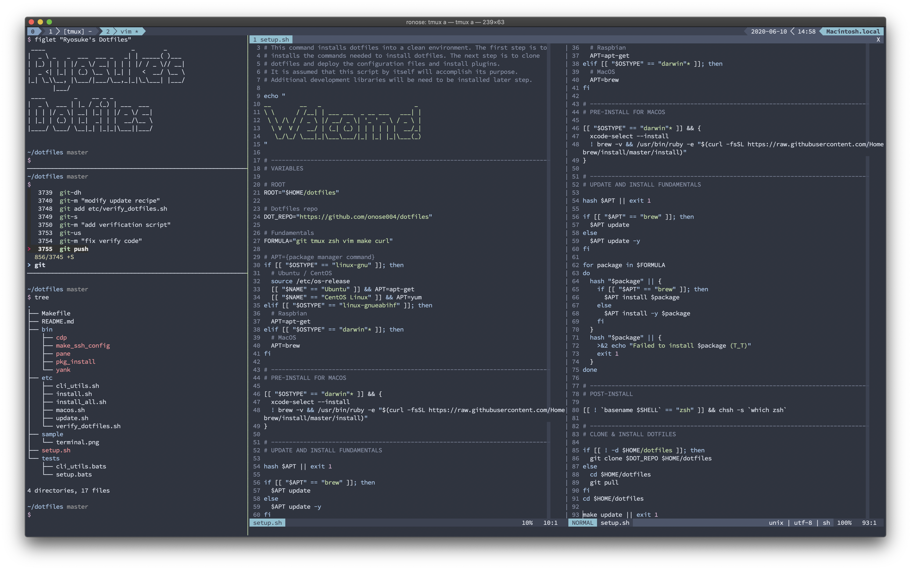

# Ryosuke's Dotfiles

My dotfiles growing like bonsai trees.



## Environment

- Ubuntu 22.04+
- CentOS Stream 9

## Setup

### 1. Clone

```sh
git clone https://github.com/onose004/dotfiles ~/dotfiles
```

### 2. Run setup

Root 権限が必要です。

```sh
sudo bash ~/dotfiles/setup.sh
```

以下が自動で行われます:

- 基本ツール (git, tmux, zsh, neovim, make, curl) のインストール
- dotfiles のシンボリックリンク作成 (`make deploy`)
- プラグイン等のインストール (`make install`)

### 3. Start zsh

```sh
exec zsh -l
```

### Update

```sh
cdot
make update
```

## What's included?

### Theme

- [Nord](https://www.nordtheme.com/) for `vim` and `tmux`
- [Source Code Pro](https://adobe-fonts.github.io/source-code-pro/) for font

### Multiplexer

- `tmux` + [tpm](https://github.com/tmux-plugins/tpm)

### Shell

- `zsh` + [zprezto](https://github.com/sorin-ionescu/prezto)
- Machine-local config: `~/.zshrc.local`

### Editor

- `neovim` + [vim-plug](https://github.com/junegunn/vim-plug)

### Utils

- `fzf` — fuzzy finder
- `ghq` — repository management
- `bats` — shell testing

## Repo structure

```
dotfiles/
├── bin/          custom utility commands
├── etc/          install / update scripts
├── tests/        bats test scripts
├── sample/       screenshot images
├── Makefile
├── setup.sh      end-to-end setup entry point
└── README.md
```
